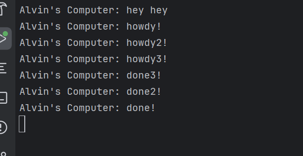
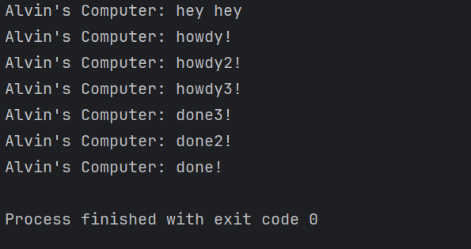

## Reflection Module 10

### Analyzing Print statement after `spawner.spawn(...)`

 
The print statement of `Alvin's Computer: hey hey` is executed first, this is caused because the `spawner.spawn(...)` function uses an async keyword and will run the method itself asynchronously. Afterward, the print statement inside of the `spawner.spawn(...)` method will be printed. Overall, `Alvin's Computer: hey hey` is printed first because it is executed first because it is a synchronous operation and will be runned first.

### Analyzing multiple spawn

#### Without `drop(spawner)`

#### With `drop(spawner)`

The main difference between the two we can see here is that when we do not use `drop(spawner)` the executor would still wait for an input, whilst when we use the `drop(spawner)` the executor will be signaled to stop the execution and will automatically finish the process. In this picture both order remains the same, however there is a case where the order of the print statement after `hey hey` may be jumbled. This is caused because of the `spawner.spawn`'s async function that can have random order in execution.
