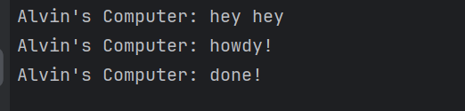

## Reflection Module 10

### Analyzing Print statement after `spawner.spawn(...)`

 
The print statement of `Alvin's Computer: hey hey` is executed first, this is caused because the `spawner.spawn(...)` function uses an async keyword and will run the method itself asynchronously. Afterward, the print statement inside of the `spawner.spawn(...)` method will be printed. Overall, `Alvin's Computer: hey hey` is printed first because it is executed first because it is a synchronous operation and will be runned first.